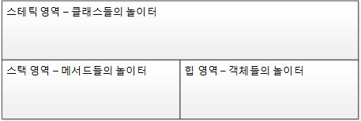
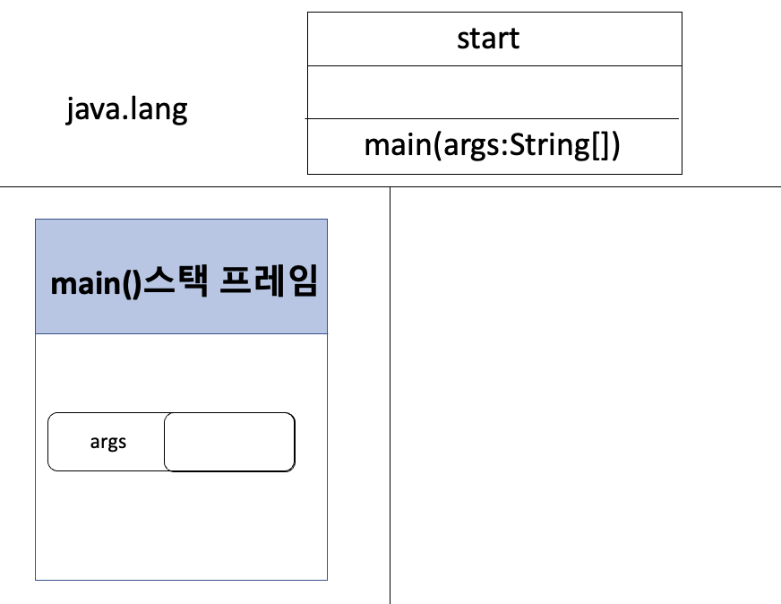
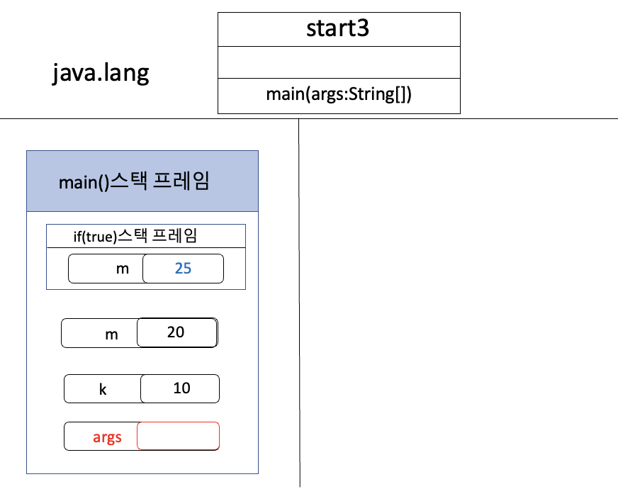
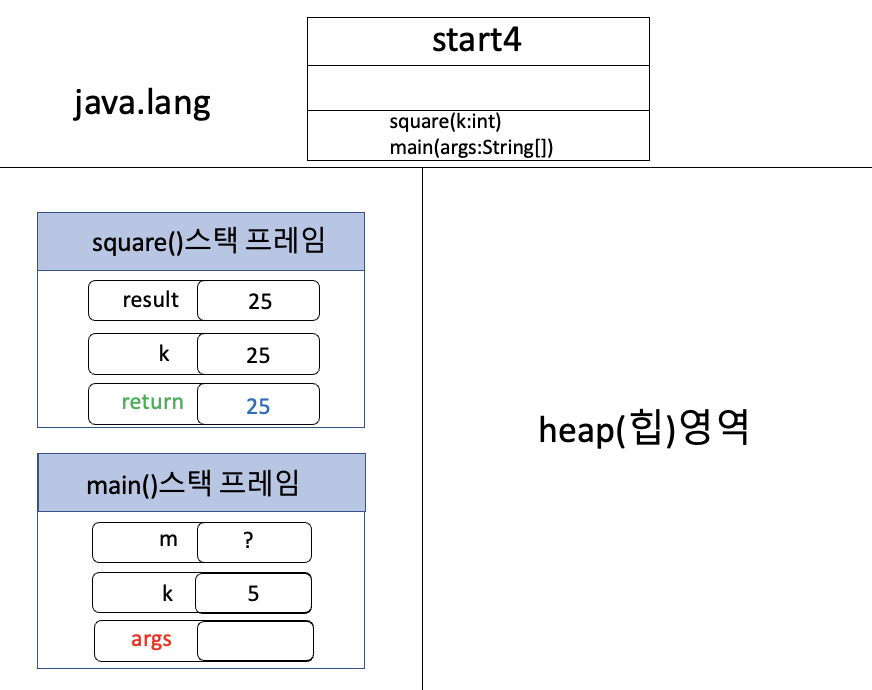
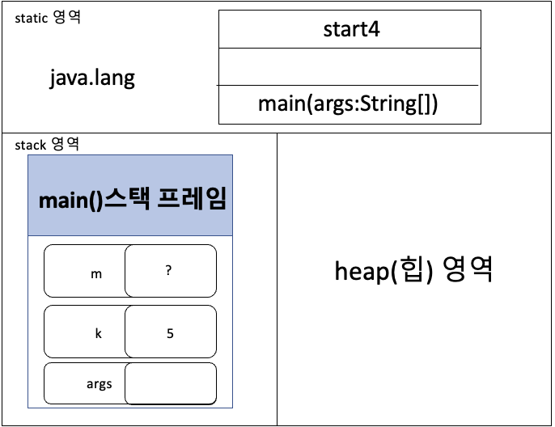
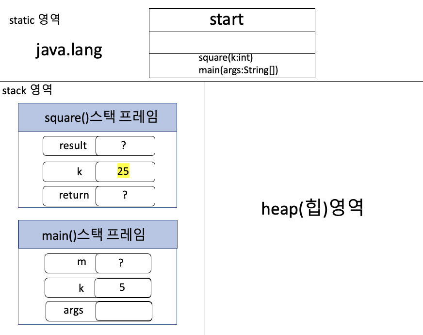
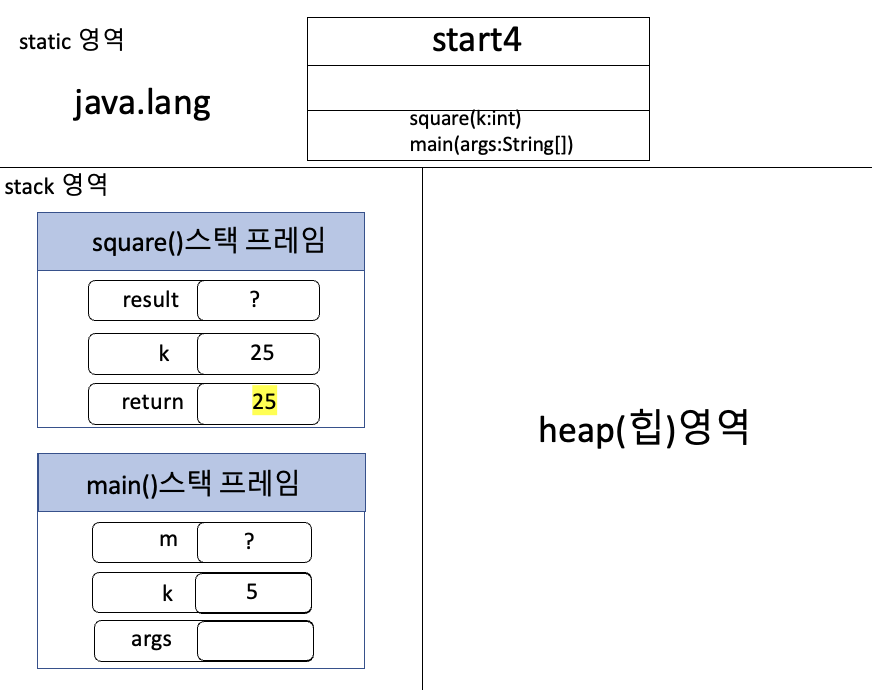
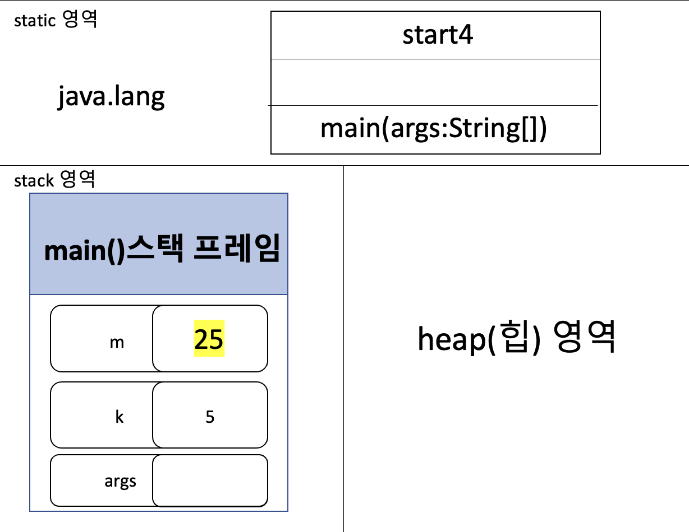
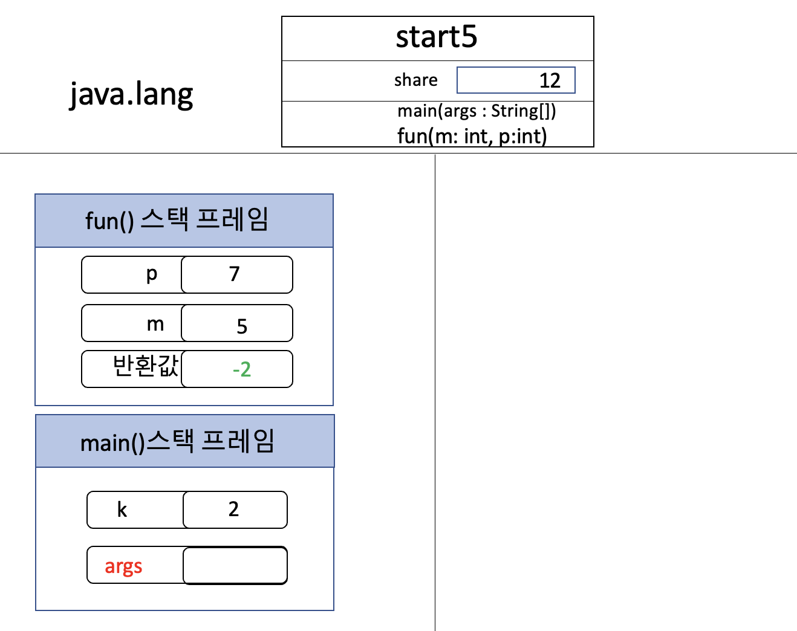
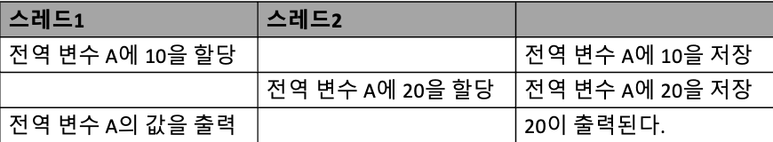

# 2장 자바와 절차적/구조적 프로그래밍

## 목차
- main()
- 변수와 메모리
- 블록 스택 프레임
- 메서드 호출과 메모리
- 전역변수와 메모리
- 멀티스레드 (Multi Thread)
- 멀티프로세스 (Multi Process)

# 메모리구성


# 프로그램 실행에 따른 T 메모리 구조 변화


> T메모리 구조는 스태틱 영역, 스택 영역, 힙 영역으로 나눌 수 있다.


# 용어
 - JDK : Java Development Kit / 자바 개발 도구
- JRE : Java Runtime Environment / 자바 실행 환경
- JVM : Java Virtual Machine / 자바 가상 기계

# 1. main()
```java
public class Start {	
	public static void main(String[] args) {	
    	System.out.println("Hello OOP!!!");
        }
    }
  ```  
  main() 메서드 실행되기 전 JVM에서 수행하는 전처리 작업
- java.lang 패키지를 T 메모리 스태틱 영역에 배치
- import 된 패키지를 T 메모리 스태틱 영역에 배치
- 프로그램 상의 모든 클래스를 T 메모리 스태틱 영역에 배치



## 객체 지향의 메모리 변화 과정
1. JRE는 프로그램안에 main() 메서드가 있는지 확인
2. JVM의 전처리
java.lang 패키지를 static 영역에 놓는다.
모든 클래스와 임포토 패키지를 static 영역에 놓는다.
3. Stack 영역에 main()의 stack frame이 할당된다.
4. main()의 인자 args를 저장할 변수 공간을 stack frame에 맨밑에 확보
5. main()이 끝난 후 Stack 영역에 main()의 stack frame이 소멸된다.
6. 메모리 소멸
7. JVM 가동 중지
8. JRE가 사용했던 시스템 자원을 운영체제에 반환

# 2. 변수와 메모리
```java
public class Star2 {
	public static void main(String[] args) {
    	int i;
        i = 10;
        
        double d = 20.0;
   	}
 }
```
## 실행 후 메모리 구조

  
  - i를 선언하게 되면 JVM이 i 변수를 위한 스택 공간을 확보한다. 

 - 이 후 값을 할당하면 변수 공간에 값을 할당하게 된다. d는 선언과 동시에 값을 할당했다. 똑같이 스택 공간을 먼저 확보하고 값을 할당하게 된다.


>  main() 메서드 내부에 생성된 변수들은 main() 스택 프레임 안에 존재하게 된다. main() 메서드가 끝나는 동시에 같이 소멸하게 된다.


# TIL : 변수와 메모리: 변수! 너 어디 있니?에 대한 답
> 변수는 T메모리 영역 어디든 존재
- 스택 영역 - 지역 변수
  - 지역 변수는 스택 영역의 스택 프레임 안에 생성된다. 스택 프레임 소멸 시 함께 소멸된다.

- 스태틱 영역 - 클래스 멤버 변수
  - JVM이 종료될 때까지 고정된(Static) 상태로 있는다.
-  힙 영역 - 객체 멤버 변수
   - 객체 멤버 변수들은 객체와 함께 힙 메모리 회수기(가비지 컬렉터)에 의해 일생을 마친다.

# 3. 블록 스택 프레임
```java
public class Start3 {
	public static void main(String[] args) {
    	int i = 10;
        int k = 20;
        
        if(i == 10) {
        	int m = k + 5;
            k = m;
        }	else {
        	int p = k + 10;
            k = p;
        }
        
        //k = m + p;
      }
  }
```


- main() 메서드의 스택 프레임안에 if 문의 블록 스택 프레임이 생성된다.
- 그리고 블록 스택 프레임 내부에 변수 m에 공간과 값이 할당 된다.
- 이 때 if 블록 밖에 있는 메인 메서드 내 변수에는 접근이 가능하다.
- 하지만, 메인 메서드에서는 if문에 있는 변수에 접근할 수 없다.

-> **메인 메서드 실행 시에는 [if 스택 프레임]이 존재할 수 없기 떄문!!!**

# 4. 메서드 호출과 메모리

```java
public class Start4 {
    public static void main(String[] args) {
        int k = 5;
        int m;

        m = square(k);
    }

    private static int square(int k) {
        int result;

        k = 25;

        result = k;

        return result;
    }

}
```


- sqaure메서드는 새로운 스택 프레임을 만든다.
- square메서드의 k와 메인 메서드의 k는 이름은 같지만 완전히 별도의 변수 공간을 가지므로 서로에게 영향을 주지 않는다.
- square의 result 값은 메서드 종료 시 사라지므로 "반환 값"에 복사하고 함수를 종료해야만 메인에서 값을 받을 수 있다.
- 메서드의 블랙박스화 -> 입력값과 반환값에 의해서만 메서드 사이에 값이 전달될 뿐 서로 내부의 지역변수를 볼 수 없다.

①  int m;까지의 실행이 끝났을 때 T 메모리 



② m = square(k) 메서드 호출 -> private static int square(int k )로 이동(square() 메서드는 인자값과 반환값을 가짐)

③ int result;까지의 실행이 끝났을 때 T 메모리 


- 메서드 호출이 일어나면 무조건 호출되는 메서드의 스택 프레임이 T 메모리 스택 영역에 새로 생성된다.
- square() 메서드는 인자,반환값을 둘 다 가지고 있기 때문에 square 스택 프레임 안에 반환값, 인자, 메서드의 지역변수의 공간이 순서대로 생성된다.

④ k=25 을 실행한 후 T 메모리



- main() 메서드가 가진 변수 k 와 square() 메서드가 가진 변수 k는 이름만 같고 서로 별도의 공간을 가지고 있다.
-> Call By Value(값에 의한 호출)

⑤ result = k 을 실행하고 나면 result 변수에 25 값이 저장되고, 16번째 줄이 끝나면 반환값 변수에 result 값인 25가 복사됨



⑥ square() 메서드의 닫는 중괄호를 만나면 square() 메서드 스택 프레임은 스택에서 사라짐. -> m = square(k); 반환값은 돌려주면서 사라진다.
여기서 square() 메서드와 main()메서드는 서로 내부의 지역 변수를 접근 할 수 없고, 입력값과 반환값에 의해서만 메서드 사이에 값이 전달된다.-> 이것을 메서드의 블렉박스화라고 한다.



⑦ 7번째 줄 main() 메서드의 닫는 중괄호로 main() 메서드 스택 프레임 또한 메모리에서 사라지고, 모든 프로그램이 종료된다.

# 5. 전역변수와 메모리
**전역 변수(Global variable)**
> 클래스 영역에서 선언한 변수로, 모든 메서드에서 공유하여 사용 가능하다.
 - 메서드 외부에서 선언되기 때문에 클래스 내 어느 곳에서나 참조할 수 있음
 - 프로그램 실행 시 처음 생성되어 프로그램이 종료될 때까지 유지되며, 모든 인스턴스가 공유함

**메모리 영역**
> 전역 변수는 메모리 공간 중 데이터 영역에 저장된다.

- 데이터 영역은 프로그램이 시작될 때 컴파일러에 의해 초기화된다.
- 초기화되지 않은 전역 변수의 값은 0으로 자동 초기화된다.
- 전역 변수는 참조하는 객체가 없으면 가비지 컬렉터에 의해 해제된다.

```java
public class Start5 {
    static int share;

    public static void main(String[] args) {
        share = 55;

        int k = fun(5, 7);

        System.out.println(share);
    }

    private static int fun(int m, int p) {
        share = m + p;

        return m - p;
    }
}
```


1. main() 메서드에서는 share 변수에 55 값을 할당하고, fun() 메서드를 호출한다. (share 변수는 전역 변수)
2.  fun() 메서드는 m + p의 값을 share 변수에 할당하고, m - p의 값을 반환한다.
3. 이때, m과 p는 매개변수로 전달되어 지역 변수로써 메모리에 할당된다. 메서드 호출이 완료되면 m과 p는 스택에서 제거된다.
4. 마지막으로 main() 메서드에서 System.out.println(share) 코드를 실행하면, fun() 메서드에서 변경된 share 변수의 값을 출력한다.따라서 실행 결과는 12가 된다.

>  위 코드에서 main() 메소드 내부에서 선언된 변수 k은 지역 변수이다. 
 - 지역 변수는 해당 블록 내에서만 사용 가능하며, 메소드가 실행될 때 메모리에 할당되고 메소드가 종료되면 메모리에서 제거된다.

>fun() 메소드 내부에서 선언된 변수 m과 p도 지역 변수이다. 
- 이 변수들도 fun() 메소드가 실행될 때 메모리에 할당되고, 메소드가 종료되면 메모리에서 제거된다.

>지역 변수와 달리 전역 변수는 클래스 내부에서 어디서든 사용할 수 있는 변수이다.

> 전역 변수는 클래스가 로드될 때 메모리에 할당되고, 프로그램이 종료될 때까지 유지된다. 
- 이 예제에서는 share가 전역 변수이다.

>share 변수는 main() 메소드와 fun() 메소드에서 모두 사용되며, 값이 변경될 때마다 메모리에 반영된다.

## 정리

전역 변수인 share 변수는 모든 메서드에서 공유되므로, fun 메서드에서 대입한 값이 main 메서드에서 출력된다.
전역 변수는 스태틱 영역에 할당되는 것을 확인할 수 있다.

또한, 메인 메서드와 fun()메서드 두 곳 모두에서 변수에 접근있다.
(스택 프레임에 독립전인 전역 변수)

# 6. 멀티스레드 (Multi Thread)
- 멀티 스레드의 T메모리 모델 ( 스택 영역을 스레드 개수만큼 분할하여 사용 )

1. 하나의 T 메모리만 사용한다.

2. 스택 영역만 분할 하여 사용한다.

3. 하나의 T 메모리의 스택 영역을 분할하여 사용하기 때문에 메모리 사용이 적다.

4. 스태틱 영역과 힙 영역은 공유한다.

# 7. 멀티프로세스 (Multi Process)
- 멀티 프로세스는 다수의 T 메모리 사용 ( 멀티 프로세스는 다수의 데이터 저장 영역, 즉 다수의 T 메모리 구조 사용 )

1. 각 프로세스마다 각자의 고유 공간을 가지고 있다.

2. 서로 참조할 수 없다.

3. 다수의 T 메모리를 사용하므로 메모리 사용량이 크다.

## 멀티 스레드에서 전역 변수 사용의 문제점
두개의 스레드로 구성된 프로그램이 있다고 가정



① 스레드1이 공유 영역(스태틱과 힙)에 있는 전역 변수 A에 10을 할당

② CPU 사용권이 스레드2로 넘어감

③ 스레드2가 전역 변수 A에 20을 할당

④ CPU 사용권이 스레드1로 넘어가서 A값을 출력

> 스레드1 입장에서 갑자기 20이라는 값이 출력되는 문제가 발생

> 쓰기 가능한 전역 변수 생성 시 스레드 안정성이 깨진다. 
- 멀티 스레드는 하나의 T 메모리의 스택 영역만 분할하여 사용

- 멀티 프로세스는 다수의 T 메모리 사용

- 멀티 스레드 사용시 전역 변수를 사용할 경우 문제가 있을수 있음