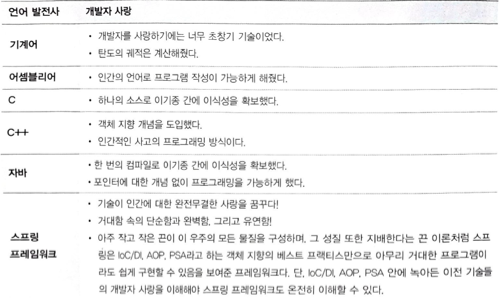

# 1장 사람을 사랑한 기술
## 기계어에서 객체 지향 프로그래밍 언어로
## 기계어
  - 2진법만 할 수 있다.
  - CPU 속도가 2GHz == 1초당 대략 20억 번 전구 스위치
  - 메모리가 1GB라면 80억 개의 전구를 한번에 관리
### 애드삭
  - 010101010000000100001001 == 1 + 3
  - 모리스 월키스 제작
  - 2진법을 적용한 세계 최초의 프로그램 내장 방식 전자계산기
### 유니박
  - 110111000001100010011000 == 1 + 3
  - 최초의 상업용 컴퓨터

=> 기종마다 기계어 코드가 다르다고 한다.

## 어셈블리어
  - 초기 : 기계어 명령어와 일상 용어를 일대일로 매칭하는 코드 -> 니모닉
  - 니모닉 : CPU마다 기계어가 다른점(각자의 어셈블리어 필요)
  - 특정 기계어에 매칭되는 어셈블리어를 만듬 ex) add
### 모방과 창조
| JAVA    | C#                  | 
|---------|---------------------|
| System.out.println()  | Console.WriteLine() |
| JDBC | ODBC                |
| ResultSet | RecordSet           |
| Nullable | Optional            |
### 구조

---
## C언어
- 강력한 이식성
- 멀티소스 -> 싱글 소스

|            | 기계어      | 어셈블리어             | C언어                  |
|------------|----------|-------------------|----------------------|
| 개발자의 코딩    | 0과 1의 나열 | 일상 단어 사용          | 수학적 기호 사용            |
| 소스 파일      | 기종마다 하나씩 | 기종마다 하나씩          | 기종이 몇 개든 단 하나        |
| 목적 파일(기계어) | 소스 그자체   | 어셈블러로 소스를 번역해 생성  | 컴파일러로 소스를 번역해 생성     |
| 기계어 비교     |  | 기계어와 1:1 대응하는 니모닉 | 기계어와 m:n 대응하는 수학적 기호 |

## C++언어
- 정말 인간적인 프로그래밍 방법론, 객체지향
- C++ = C + 객체지향 

## 자바 
- 진정한 객체 지향 언어
- 컴파일러를 기종별로 따로 구매 X
- Write Once Use Anywhere
- 한 번의 컴파일로 이기종 간에 이식성을 확보
- 포인터에 대한 개념 없이 프로그래밍을 가능

