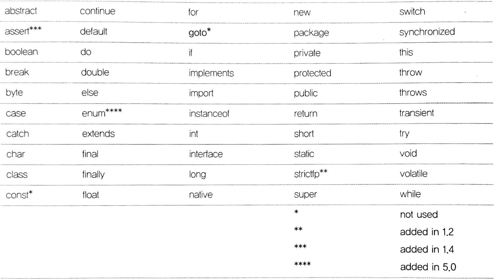
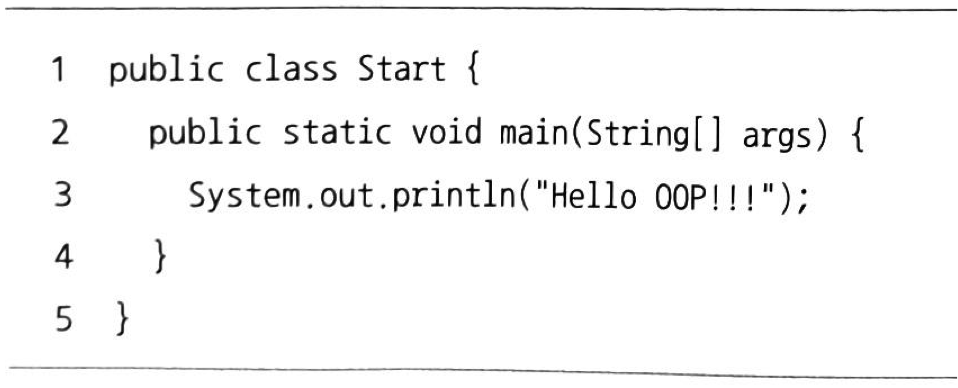
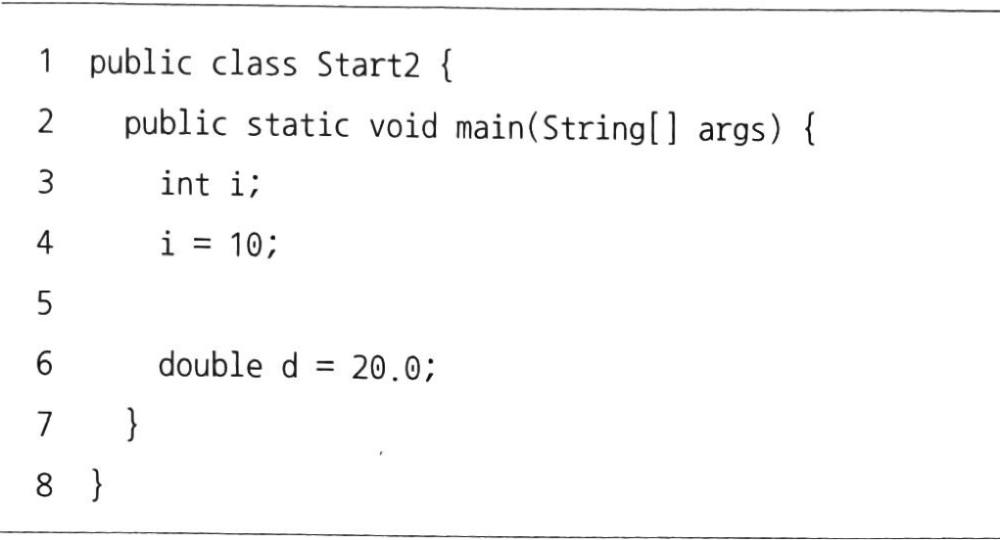
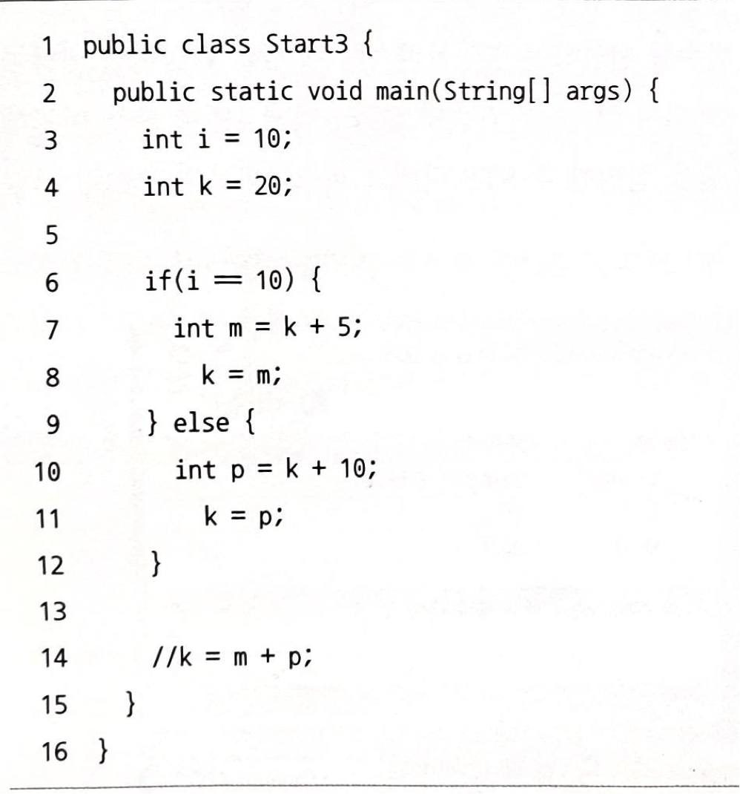
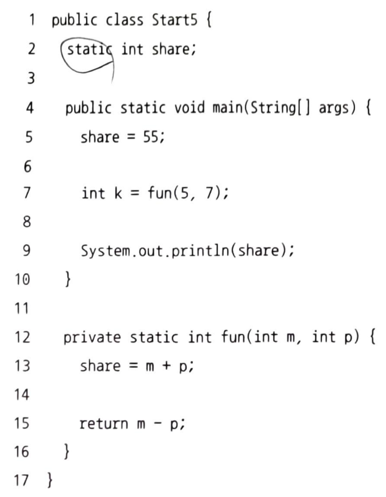

# 자바와 절차적/구조적 프로그래밍

## 자바 프로그램의 개발과 구동
- JDK(Java Development Kit) : JVM용 소프트웨어 개발 도구
- JRE(Java Runtime Environment) : JVM용 OS
- JVM(Java Virtual Machine) : 가상의 컴퓨터
- 자바 소스 파일 -> 자바 번역기 -> 자바 목적 파일 -> 자바 실행 환경

### 프로그램이 메모리를 사용하는 방법
- 코드 실행 영역
- 데이터 저장 영역
  - 스태틱 영역
  - 스택 영역
  - 힙 영역

###  자바에 존재하는 절차적/구조적 프로그래밍의 유산
- 절차적 프로그래밍
  - goto 쓰지말라
  - 

#### goto 사용하지 않는 이유
- 프로그램의 실행 순서 이해 어려워짐
- goto 이용한 이동 == 프로그램을 논리적으로 잘 구성하면 모두 피할 수 있다.
- 구조적 프로그래밍을 함수를 써라
  - 중복 코드를 한 곳에 모아서 관리
  - 논리를 함수 단위로 분리해서 이해하기 쉬운 코드를 작성
  - 공유 사용 시 전역 변수보다는 지역 변수를 써라

#### 절차적.구조적 프로그래밍의 유산
- 함수 : 중복 코드 제거 + 논리 분할 
- 제어 : 순서도 + 제어문
- 함수 (절차적/구조적) : 메서드(객체지향)
- 클래스 외부 존재할 수 있는 것 없(객체지향) -> import문은 게으름의 산물

### 다시 보는 main() 메서드: 메서드 스택 프레임
##### JRE: main() 메소드가 있는 확인(Start 클래스에서 main() 메소드 발견) -> JRE 프로그램 실행을 위한 사전 준비에 착수-> JVM 전원을 넣어 부팅 -> 목적파일을 받아 실행 -> 전처리 작업 = JVM: 모든 클래스 + 임포트 패키지 + 스태틱 영역 (클래스들의 놀이터) 

#### 전처리 작업 
- java.lang 패키지를 T 메모리의 스태틱 영역에 배치한다
- import된 패키지를 T 메모리의 스태틱 영역에 배치한다
- 프로그램 상의 모든 클래스를 T 메모리의 스태틱 영역에 배치한다.

#### 메소드 
___

--- 
- 메소드들의 놀이터 -> 스택
- main 메소드 = 스택 프레임(중괄호 -> 스택 프레임)을 스택 영역에 할당
- 메소드 인자 args를 저장할 변수 공간 => 스택 프레임의 맨 밑에 확보
- T 메모리를 구성 -> main 메소드 안의 첫 명령문을 실행

#### T 메모리
- 변화 X
- main() 메소드의 스택 프레임이 생긴다 
- 닫는 중괄호 => 스택 프레임이 소멸

1. main() 메소드가 끝난다
2. JRE을 종료한다
3. JRE 자체도 운영체제 상의 메모리에서 사라진다
4. T 메로리도 사라진다

## 변수와 메모리: 변수! 너 어디 있니?

### T 메모리 상태 
- start -> start2 
- 3번째 줄 완료되면 i가 선언되고 값을 ?로 처리
- 4번째 줄 완료되면 스택 프레임에 i의 값이 10이 된다.
- 6번째 줄 완료되면 스택 프레임에 d와 d의 값이 들어가게 된다. (두개의 명령문)
- 7번째 줄 스택 프레임이 스택 영역에서 사라진다 -> 프로그램 종료

## 블록 구문과 메모리: 블록 스택 프레임

### T 메모리 상태
- 3줄 스택 프레임에 i와 i의 값 10이 맨밑에 들어간다.
- 4줄 스택 프레임에 k와 k의 값 20이 그 위에 들어간다. 
- 6줄 if 블록 if(true) 스택 프레임
- 7줄 int m; ,m = k+5; if(true) 스택 프레임에 m 선언 후 값을 k+5, 즉 25를 넣어준다.
- 8줄 k의 값이 m의 값인 25로 바뀐다.
- 9줄 if문이 true이면 스택 프레임을 삭제 시킴 -> 9~12줄 삭제
- 14줄 주석을 풀어줄 경우 k의 값에 m+p 넣어주는 형태이다. 그러나 if문에 있던 스택프레임이어서 이미 사라지고 난 후이다.

## 지역 변수와 메모리: 스택 프레임에 같혔어요!
- 가비지 컬렉터 : 힙 메모리 회수기
- Start3 예제 사용시 5줄 or 13줄에 System.out.println(m) 할 시 오류가 뜬다.
- 결론 : 외부 스택 프레임에서 내부 스택 프레임의 변수에 접근하는 것은 불가능하나 그 역은 가능하다.

## 메소드 호출과 메모리: 메소드 스택 프레임

### T 메모리 상태
- 3줄 스택 프레임에 k와 k의 값 5이 들어간다.
- 4줄 스택 프레임에 m이 들어간다.
- 6줄 square() 메소드 호출 -> 9줄로 이동
- 11줄 main 스택 프레임 따로 square 스택 프레임이 그 위에 올려진다.
- 12줄 square 스택 프레임안에 k의 값이 25로 들어온다.
- 14줄 result의 값이 k로 들어온다.
- 16줄 호출한 쪽에 돌려줄 값을 가져야 할 반환값 변수에 result 변수에 담긴 값이 복사되어 나간다.
- 6줄 m = 25로 값이 들어간다.
- 7줄 프로그램 종료

## 서브 메소드가 main 메소드의 지역 변수를 참조할 수 없도록 지정한 이유
- 메소드 = 고유 공간
- 포인터 문제 
  - 지역 변수의 위치를 정확히 알아야 하는데 그 지역 변수의 주소를 알아야하지만 자바에는 그런 기능이 없다.
- 포인터 주고 받는 문제 불가능

## 전역 변수와 메모리: 전역 변수 쓰지 말라니까요!

- 메소드 사이의 값을 공유하는 방법: 전역 변수

### T 메모리 상태
- 4줄 share 변수 start5 클래스에 생기고, main 스택 프레임이 생긴다.
- 7줄 k = fun(5,7) k 선언, 12줄 이동
- 13줄 start5 클래스에 전역 변수 share의 값이 m+p로 주어진다.
- 다시 돌아가서 main 메소드에 share = 55 로 인해 55라고 착각가능 

## 멀티 스레드 / 멀티 프로세스의 이해
- 멀티 스레드의 T 메모리 모델은 스택 영역을 스레드 개수만큼 분할해서 쓰는 것
- 멀티 프로세스 -> 각자의 T 메모리 각자 고유의 공간 서로 참조 x 
- 멀티 스레드 -> 하나의 T 메모만 사용 스택 영역만 분할해서 사용하는 구조
- 결론 : 멀티 프로세스는 접근 불가 참조 불가 , 멀티 스레드는 스태틱 영역과 힙 영역은 공유해서 사용하는 구조
