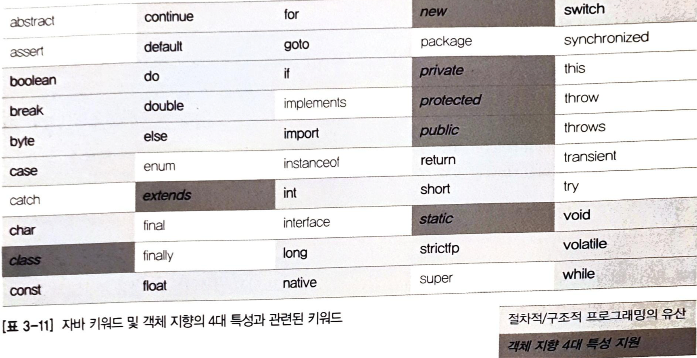

# 자바와 객체 지향
## 객체 지향은 인간 지향이다.
- 기계어 -> 어셈블리어 -> C,C++,자바(인간을 위한 발전)
- 객체지향 : 우리가 눈으로 보고, 느끼고, 생활하는 현실 세계처럼 프로그래밍할 수는 없는가?
  - 모든 것을 사물로 인식하여 현실 세계를 인지하는 방식으로 프로그램을 만들자는 목표
- 함수 : 논리적인 단위로 구분하고 분할해서 정복

### 객체지향
- 객체 
  - 고유하다
  - 속성을 갖는다
  - 행위를 한다
  - 세상의 존재하는 모든 것
- 분류 (class)
  - 객체들은 속성 or 행위로 인해 분류된다

## 객체 지향의 4대 특성 - 캡! 상추다.
- 캡 - 캡슐화 : 정보 은닉
- 상 - 상속 : 재사용
- 추 - 추상화 : 모델링
- 다 - 다형성 : 사용 편의

## 클래스 vs 객체 = 붕어빵틀 vs 붕어빵 ???
- 클래스와 객체의 관계 중 하나(객체 = 클래스의 인스턴스)가 붕어빵틀과 붕어빵이지, 전부는 아님
- 객체
  - 실체
- 클래스
  - 실체 x 

## 추상화: 모델링
- 분해/결합
- 특징 -> 극대화
- 구체적인 것을 분해 -> 관심 있는 특성만 가지고 재조합
- 클래스: 실존 X -> 실존하는 객체로부터 이해
- 메소드 : 객체지향에서의 기능/행위
- 애플리케이션 경계 : 프로그램의 관심 영역
- 모델 : 정확히 복제 X  , 관심 있는 특성만을 추출해서 표현하는 것
- 추상화 = 모델링 = 자바의 class 키워드 
- 클래스 객체_참조_변수 = new 클래스();

## 추상화와 T 메모리
- main() : 클래스의 멤버 메소드 
- sing() : 객체의 멤버 메소드 
- 힙 : 메모리를 사용하는 방식

## 클래스 멤버 vs 객체 멤버 = static 멤버 vs 인스턴스 멤버
- 객체 : 유일무이 -> 속성의 값을 가짐
- 클래스 : 분류체계 -> 속성의 값을 가지지 않음
- 클래스 멤버 : 정적 멤버: 스태틱 멤버 = 객체 멤버: 오브젝트 멤버 : 인스턴스 멤버

## 상속: 재사용 + 확장
- 상위 클래스 - 하위 클래스 or 슈퍼 클래스 - 서브 클래스
- 상속보다는 확장, 세분화라는 말이 더 어울린다
- 상위 클래스 : 추상화, 일반화 ↑
- 하위 클래스 : 구체화, 특수화 ↑
- 분류도 or 벤 다이어그램을 그려보면 더욱 이해하기 쉽다
  - 하위 클래스 = 상위 클래스
  
 
★ 객체 참조 변수명은 객체스럽게 클래스명은 클래스답게 정하는 습관!!
- 클래스 상속 구곶에서 최상위 클래스는 객체이다. -> 모든 클래스는 객체의 특성을 물려받음 -> ex) toString()
   
## 상속 is a 관계를 만족해야 한다?
- 잘못된 표현 : 하위 클래스 is a 하나의 상위 클래스 -> 하나의 상위 클래스 = 객체
- 좋은 표현 : is a kind of -> 하위 클래스는 상위 클래스의 한 분류다.

## 다중 상속과 자바
- 다중 상속의 단점 
  - 다이아몬드 문제 : 상속을 받아오는 과정에서의 상위 클래스의 공통적인 부분으로 인한 어려움
  - 득보다 실이 많다
- 다중 상속 x -> 인터페이스 도입 
  - 구현 클래스 is able to 인터페이스 -> 구현 클래스는 인터페이스할 수 있다.
- 상위 클래스 : 특성을 상속 -> 많으면 좋음
- 인터페이스 : 기능을 구현하도록 강제  -> 적으면 좋음

## 다형성: 사용편의성
- 오버라이딩 : 같은 메소드 이름, 같은 인자 목록으로 상위 클래스의 메소드를 재정의
- 오버로딩 : 같은 메소드 이름, 다른 인자 목록으로 다수의 메소드를 중복 정의

## 캡슐화 : 정보 은닉 
- 접근 제어자
  - private - 본인만 접근 가능
  - default - 같은 패키지 내의 클래스에서 접근 가능
  - protected - 상속/같은 패키지 내의 클래스에서 접근 가능
  - public - 모두가 접근 가능 

## 참조 변수의 복사
- 기본 자료형 변수 : 저장하고 있는 값 -> 그 값 자체
- 객체 참조 변수 : 저장하고 있는 값 -> 주소(포인터)

## 정리 - 자바 키워드와 OOP 4대 특성
